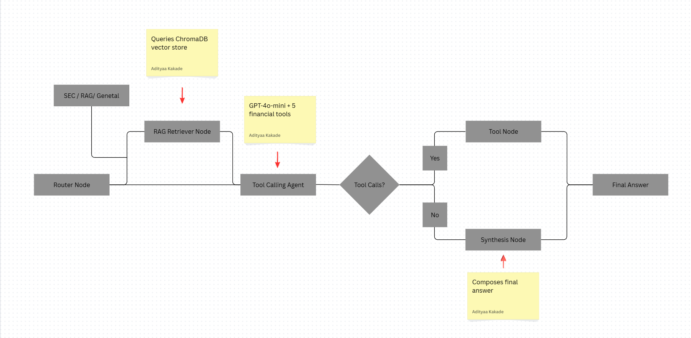

# FinSight — Agentic Financial Research Analyst

> A LangGraph multi-agent system that autonomously researches stocks, SEC filings,
> financial ratios, news, and portfolio risk — cutting per-company research time from ~45 min to under 3 min.


---

## Table of Contents

1. [Overview](#overview)
2. [Architecture](#architecture)
3. [Project Structure](#project-structure)
4. [Setup — Windows](#setup--windows)
5. [Setup — macOS / Linux](#setup--macos--linux)
6. [Configuration](#configuration)
7. [Usage Guide](#usage-guide)
8. [Tools Reference](#tools-reference)
9. [RAG Pipeline](#rag-pipeline)
10. [Troubleshooting](#troubleshooting)
11. [Extending FinSight](#extending-finsight)
12. [Disclaimer](#disclaimer)

---

## Overview

FinSight is a production-grade agentic AI system built with **LangGraph** and **GPT-4o-mini**
that acts as your personal financial research analyst. Ask it anything about:

- 📈 **Live stock prices** and market data
- 📊 **Financial ratios** — P/E, P/B, EV/EBITDA, ROE, margins
- 📰 **Recent news** for any company or topic
- 📄 **SEC filings** — 10-K, 10-Q, 8-K links and summaries
- 🧮 **Portfolio risk scoring** — beta, Sharpe ratio, volatility, diversification
- 🔍 **RAG over indexed SEC documents** — ask deep questions about filed documents

---

## Architecture

`

### Agent Flow Summary

| Step | Node | What it does |
|------|------|--------------|
| 1 | **Router** | Classifies query as `stock`, `ratios`, `news`, `sec_filing`, `portfolio`, `rag`, or `general` |
| 2 | **RAG Retrieval** | If query needs document context, fetches top-5 chunks from ChromaDB |
| 3 | **Tool Agent** | Decides which tool(s) to call based on query + context |
| 4 | **Tool Node** | Executes the tool calls (yFinance, SEC EDGAR, etc.) |
| 5 | **Synthesis** | Combines tool outputs + RAG context into a coherent answer |

---

## Project Structure

```
finsight/
│
├── app.py                      # Streamlit UI — dark theme, chat interface, sidebar
│
├── agents/
│   ├── __init__.py
│   └── graph.py                # LangGraph 5-node agent graph + state definition
│
├── tools/
│   ├── __init__.py
│   └── financial_tools.py      # 5 LangChain @tool functions
│
├── rag/
│   ├── __init__.py
│   └── pipeline.py             # ChromaDB ingestion, chunking, retrieval
│
├── chroma_db/                  # Auto-created on first ingest (persistent vector store)
│
├── requirements.txt
├── .env.example
└── README.md
```

---

## Setup — Windows

> Use PowerShell in VS Code (Terminal → New Terminal). Run each step in order.

### Step 1 — Fix PowerShell execution policy

By default, Windows blocks script execution. Run this once:

```powershell
Set-ExecutionPolicy -ExecutionPolicy RemoteSigned -Scope CurrentUser
```

Press `Y` to confirm.

### Step 2 — Create virtual environment

```powershell
python -m venv venv
```

### Step 3 — Activate virtual environment

```powershell
venv\Scripts\activate
```

You should now see `(venv)` at the start of your prompt:

```
(venv) PS D:\Projects\finsight>
```

> ⚠️ Every time you open a new terminal, you must re-run this activate command before running the app.

### Step 4 — Install dependencies

Install in groups to avoid C++ build errors:

```powershell
pip install openai langchain langchain-openai langchain-community langgraph
pip install chromadb sentence-transformers
pip install streamlit plotly
pip install pandas numpy requests beautifulsoup4 yfinance
pip install python-dotenv tiktoken faiss-cpu
```

> Why not `pip install -r requirements.txt`?
> The `ragas` package pulls in `scikit-network` which requires Microsoft C++ Build Tools
> to compile on Windows. Skipping it is safe — ragas is only needed for offline RAG
> evaluation, not for running the app.

### Step 5 — Set your OpenAI API key

```powershell
Copy-Item .env.example .env
```

Open `.env` in VS Code and make sure it looks exactly like this:

```
OPENAI_API_KEY=sk-proj-your-actual-key-here
```

> The key must have the `OPENAI_API_KEY=` prefix. The raw key alone will not work.

### Step 6 — Run the app

```powershell
streamlit run app.py
```

Open **http://localhost:8501** in your browser.

---

## Setup — macOS / Linux

### Step 1 — Create and activate virtual environment

```bash
python3 -m venv venv
source venv/bin/activate
```

### Step 2 — Install dependencies

```bash
pip install -r requirements.txt
```

### Step 3 — Configure API key

```bash
cp .env.example .env
nano .env   # or: code .env
```

Add your key:

```
OPENAI_API_KEY=sk-proj-your-actual-key-here
```

### Step 4 — Run

```bash
streamlit run app.py
```

---

## Configuration

| Parameter | Default | File | Location |
|-----------|---------|------|----------|
| LLM model | `gpt-4o-mini` | `agents/graph.py` | `get_llm()` |
| LLM temperature | `0.0` | `agents/graph.py` | `get_llm()` |
| Synthesis temperature | `0.1` | `agents/graph.py` | `synthesis_node()` |
| Max agent iterations | `5` | `agents/graph.py` | `should_continue_or_synthesize()` |
| Chunk size | `512 tokens` | `rag/pipeline.py` | `CHUNK_SIZE` |
| Chunk overlap | `64 tokens` | `rag/pipeline.py` | `CHUNK_OVERLAP` |
| Top-K retrieval | `5` | `rag/pipeline.py` | `TOP_K` |
| Embedding model | `all-MiniLM-L6-v2` | `rag/pipeline.py` | `get_chroma_collection()` |
| ChromaDB path | `./chroma_db` | `rag/pipeline.py` | `CHROMA_PATH` |
| Max filing text | `50,000 chars` | `rag/pipeline.py` | `fetch_filing_text()` |

---

## Usage Guide

### Basic Queries

Type any financial question in the chat input box:

```
What is Apple's current stock price?
What is Tesla's P/E ratio and gross margin?
Fetch the latest news for NVIDIA
What SEC filings are available for Microsoft?
Compare debt-to-equity ratios of AAPL and MSFT
```

### Portfolio Risk Analysis

Ask in plain English:

```
Score a portfolio: AAPL 40%, MSFT 30%, GOOGL 30%
Analyze my portfolio risk: TSLA 50%, NVDA 25%, AMZN 25%
```

You'll receive: annual volatility, Sharpe ratio, portfolio beta, HHI concentration
score, individual stock betas, correlation matrix, and risk warnings.

### SEC Filing RAG (Deep Document Research)

For questions about the content of annual reports, risk factors, or earnings discussions:

1. Enter a ticker in the sidebar (e.g. `AAPL`)
2. Select filing type (`10-K` for annual, `10-Q` for quarterly)
3. Set number of filings (1–5)
4. Click **⬇ Ingest Filings** and wait for the green confirmation
5. Now ask:

```
What are Apple's main risk factors?
What does Microsoft say about AI competition in their latest 10-K?
Summarize Amazon's liquidity position from their most recent filing
```

### Checking Vector Store Contents

Click **🔍 Refresh Stats** in the sidebar to see total chunks indexed, which tickers
have been ingested, and what filing types are available.

---

## Tools Reference

### 1. `live_stock_lookup(ticker)`

Fetches real-time market data via yFinance.

Returns: current price, previous close, % change, market cap, volume,
52-week high/low, sector, industry.

Example trigger: *"What is Apple's stock price?"*

---

### 2. `financial_ratio_calculator(ticker)`

Calculates comprehensive financial ratios.

Returns:
- Valuation: P/E, forward P/E, PEG, P/B, P/S, EV/EBITDA, EV/Revenue
- Profitability: gross margin, operating margin, net margin, ROE, ROA
- Liquidity: current ratio, quick ratio, debt-to-equity, free cash flow
- Growth: revenue growth YoY, earnings growth YoY

Example trigger: *"What is Tesla's P/E ratio and return on equity?"*

---

### 3. `news_fetcher(query)`

Retrieves recent news headlines and summaries via yFinance.

Returns: up to 8 articles with title, publisher, publish date, summary, and link.

Example trigger: *"Latest news for NVIDIA"*

---

### 4. `sec_filing_retriever(ticker, filing_type)`

Fetches recent SEC filing metadata from SEC EDGAR.

Supported types: `10-K` (annual), `10-Q` (quarterly), `8-K` (current events)

Returns: filing dates, accession numbers, and direct document URLs for up to 5 filings.

Example trigger: *"Show me Amazon's recent 10-K filings"*

---

### 5. `portfolio_risk_scorer(portfolio_json)`

Analyzes portfolio risk using 1-year historical price data.

Input format:
```json
[
  {"ticker": "AAPL", "weight": 0.4},
  {"ticker": "MSFT", "weight": 0.35},
  {"ticker": "NVDA", "weight": 0.25}
]
```

Returns: risk level, annual volatility, expected return, Sharpe ratio,
portfolio beta, HHI concentration index, per-stock betas, correlation
matrix, and risk warnings.

Example trigger: *"Score my portfolio: AAPL 40%, TSLA 30%, GOOGL 30%"*

---

## RAG Pipeline

### Ingestion Flow

```
SEC EDGAR API
      │
      ▼
Fetch filing HTML / text
      │
      ▼
BeautifulSoup parsing + cleaning
      │
      ▼
Recursive word-level chunking
512 tokens, 64-token overlap
      │
      ▼
SentenceTransformer embeddings
all-MiniLM-L6-v2
      │
      ▼
ChromaDB persistent store
cosine similarity index
```

### Retrieval Flow

```
User query
      │
      ▼
Embed query (same model)
      │
      ▼
ChromaDB cosine similarity search
top-5 chunks, optional ticker filter
      │
      ▼
Format as context string
      │
      ▼
Injected into agent system prompt
```

### Chunking Strategy

512-word chunks balance context preservation against retrieval precision.
64-word overlap prevents important cross-sentence context from being lost at
chunk boundaries. Preprocessing removes non-ASCII characters, excessive
whitespace, and HTML script/style tags before chunking.

---

## Troubleshooting

### `streamlit` not recognized

Cause: Virtual environment not activated, or dependencies not installed.

```powershell
venv\Scripts\activate          # activate first
pip install streamlit          # install if missing
streamlit run app.py           # then run
```

### PowerShell execution policy error

```powershell
Set-ExecutionPolicy -ExecutionPolicy RemoteSigned -Scope CurrentUser
```

### `scikit-network` build failure

Cause: Missing Microsoft C++ Build Tools on Windows.
Fix: Install packages individually as shown in the Windows Setup Step 4.
`scikit-network` is a dependency of `ragas` which is not required to run the app.

### `cp` not found on Windows

`cp` is a Linux command. Use the PowerShell equivalent:

```powershell
Copy-Item .env.example .env
```

### API key not loading

Your `.env` file must have the `OPENAI_API_KEY=` prefix:

```
OPENAI_API_KEY=sk-proj-...   ✅ correct
sk-proj-...                   ❌ wrong — key has no prefix
```

### ChromaDB errors

Delete and recreate the vector store, then re-ingest:

```powershell
Remove-Item -Recurse -Force chroma_db   # Windows
rm -rf chroma_db                         # macOS/Linux
```

### SEC EDGAR returns no results

SEC EDGAR rate-limits requests. If making many calls quickly, wait 30 seconds
and try again. The tool sends a polite `User-Agent` header as required by SEC policy.

### `(venv)` disappears after opening a new terminal

You must re-activate every session:

```powershell
venv\Scripts\activate     # Windows
source venv/bin/activate  # macOS/Linux
```

---

## Extending FinSight

### Add a New Tool

1. Open `tools/financial_tools.py` and define your tool:

```python
@tool
def earnings_calendar(ticker: str) -> str:
    """
    Fetch upcoming earnings dates and EPS estimates for a ticker.
    Input: ticker symbol e.g. 'AAPL'
    """
    # your implementation here
    ...
```

2. Add it to `ALL_TOOLS` at the bottom of the file:

```python
ALL_TOOLS = [
    live_stock_lookup,
    financial_ratio_calculator,
    news_fetcher,
    sec_filing_retriever,
    portfolio_risk_scorer,
    earnings_calendar,    # ← add here
]
```

3. Optionally update the router in `agents/graph.py` with a new category.

### Swap the LLM

In `agents/graph.py`, replace the `get_llm()` function:

```python
# Use Claude instead of GPT-4o-mini
from langchain_anthropic import ChatAnthropic

def get_llm(temperature=0.0):
    return ChatAnthropic(model="claude-sonnet-4-20250514", temperature=temperature)
```

### Add a Fine-Tuned Model

Use your LoRA fine-tuned model in the synthesis node:

```python
from langchain_community.llms import HuggingFacePipeline
from transformers import pipeline

hf_pipe = pipeline("text-generation", model="path/to/your/finetuned-model")
local_llm = HuggingFacePipeline(pipeline=hf_pipe)
# Use local_llm in synthesis_node() instead of get_llm()
```

### Enable Hybrid Retrieval

Combine ChromaDB semantic search with BM25 keyword search for better
recall on exact financial figures:

```python
from langchain_community.retrievers import BM25Retriever
from langchain.retrievers import EnsembleRetriever

ensemble = EnsembleRetriever(
    retrievers=[chroma_retriever, bm25_retriever],
    weights=[0.6, 0.4]   # Reciprocal Rank Fusion
)
```

---

## Disclaimer

FinSight is built for **research and educational purposes only**. All outputs —
including stock data, ratio calculations, filing summaries, and portfolio analysis
— are provided as-is and do not constitute financial advice. Always consult a
qualified financial advisor before making any investment decisions. Past
performance is not indicative of future results.
